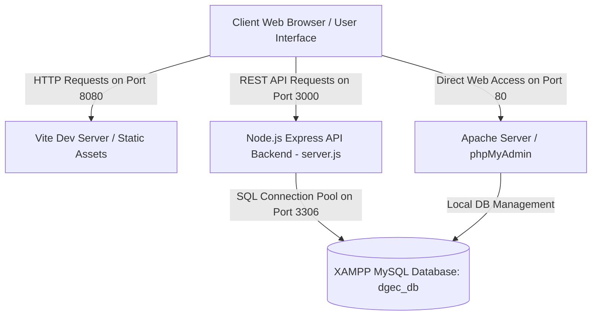
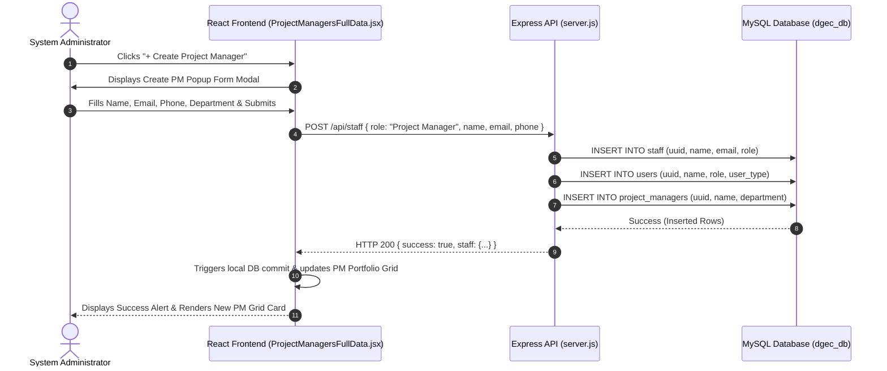
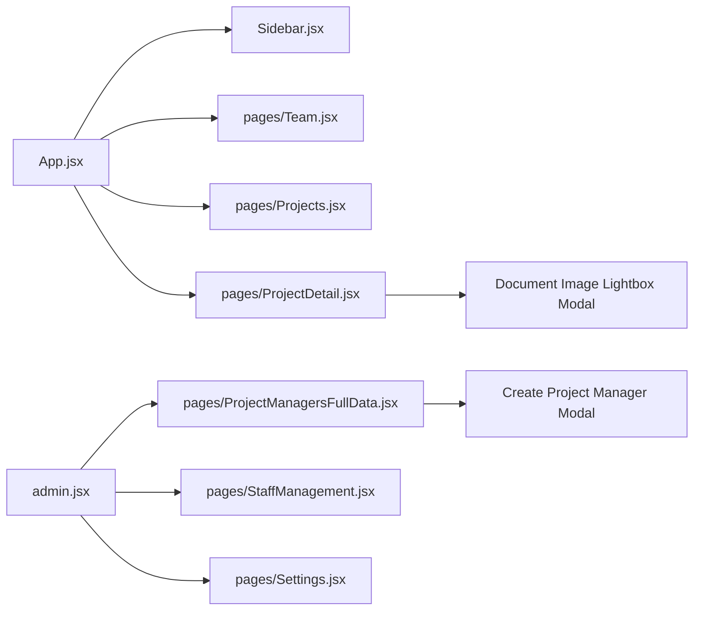

# 🚀 DGEC Engineering Project Control Dashboard - System Manifest

> **System Manifest & Technical Documentation**  
> **Version**: 2.5.0  
> **Environment**: Windows / Node.js v22+ / XAMPP Apache & MySQL / Vite + React 18  

---

## 📌 1. Project Overview & Purpose

The **Dar Al Gulf Engineering Consultants (DGEC) Dashboard** is an enterprise-grade, multi-portal engineering project control and staff management system. It provides real-time oversight for architectural, MEP, structural, and infrastructure engineering projects across four role-based user interfaces:

1. **👑 Administrator Control Panel (`/admin`)**: Full system oversight, staff performance analytics, PM portfolio grid, financial invoice controls, and database configuration.
2. **💼 Project Manager Control Centre (`/`)**: Multi-column project portfolio grid, assigned teammate management, client scoping, task creation, and document verification.
3. **🛠️ Staff Engineering Portal (`/staff`)**: Individual task execution matrix, time tracking, blueprint image previews, and completion reporting.
4. **🏢 Client Portal (`/client`)**: Scoped project progress view, approved document image lightbox, milestone tracking, and billing invoice reviews.

---

## 📁 2. Complete Folder & File Structure

```
DGEC/
├── index.html                       # Main React HTML Entrypoint
├── admin.html                       # Dedicated Admin Portal HTML
├── client.html                      # Dedicated Client Portal HTML
├── staff.html                       # Dedicated Staff Portal HTML
├── login.html                       # Standalone Authentication Portal
├── server.js                        # Node.js Express Backend API & MySQL Connection
├── package.json                     # Node Dependencies & Build Scripts
├── vite.config.js                   # Vite Dev Server Configuration (Port 8080)
│
├── src/
│   ├── main.jsx                     # Core React App Hydration
│   ├── App.jsx                      # Main Navigation Shell, Sidebar Router & Shared State
│   ├── admin.jsx                    # Admin Panel Layout Router
│   ├── client.jsx                   # Client Portal Layout Router
│   ├── staff.jsx                    # Staff Portal Layout Router
│   │
│   ├── pages/
│   │   ├── AdminStaffPortal.jsx     # Admin Staff Oversight Matrix
│   │   ├── PMStaffPortal.jsx        # PM Staff Oversight & Assignment
│   │   ├── ProjectDetail.jsx        # Project Breakdown, Documents, Comments & Lightbox Modal
│   │   ├── ProjectManagersFullData.jsx # PM Portfolio Grid & PM Creation Modal
│   │   ├── Projects.jsx             # Project List & Multi-Filter Matrix
│   │   ├── Settings.jsx             # System Statuses & Portal Navigation
│   │   ├── StaffManagement.jsx      # Admin Staff Directory & Performance View
│   │   └── Team.jsx                 # PM Responsive Teammates Grid Layout
│   │
│   ├── components/
│   │   ├── Avatar.jsx               # Dynamic Initials Avatar Generator
│   │   ├── Bar.jsx                  # Animated Multi-Color Progress Bar
│   │   ├── EditableList.jsx         # Dynamic Category & Status Chip Editor
│   │   ├── ErrorBoundary.jsx        # React Error Trap & Fallback View
│   │   ├── Modal.jsx                # Universal Task & Project Creation Modal
│   │   ├── Sidebar.jsx              # Role-Scoped Navigation Sidebar
│   │   ├── Tag.jsx                  # Color-Coded Status Pill Badge
│   │   └── UserAccessGuideCard.jsx  # Security & Access Documentation
│   │
│   └── utils/
│       ├── helpers.js               # Formatting, Color Logic & Calculations
│       ├── mysql.js                 # MySQL Connection Pool & Query Wrapper
│       └── mockData.js              # Fallback Offline State
│
└── scratch/
    ├── create_pm_table.js           # MySQL Table Setup & Seeding Script
    └── cleanup_db.js                # Database Sanitation Utility
```

---

## 📐 3. System Architecture & Workflows

### 🏗️ Architecture Diagram


---

### 🔄 Data Flow Sequence Diagram


---

### 📂 File Relationship Diagram


---

## 🗄️ 4. Database Structure (`dgec_db`)

| Table Name | Key Columns | Description |
| :--- | :--- | :--- |
| `admin` | `id, username, password_hash, email` | Primary System Administrator Account |
| `users` | `id, uuid, name, username, email, role, user_type` | Unified Authentication User Directory |
| `project_managers` | `id, uuid, name, username, email, phone, department` | Executive Project Manager Directory |
| `staff` | `id, uuid, name, contact_number, email, role` | Permanent Company Staff Records |
| `clients` | `id, uuid, name, email, phone, company` | Client Directory Records |
| `projects` | `id, uuid, name, pm_id, client_id, category, progress, total_cost` | Engineering Projects Registry |
| `tasks` | `id, uuid, project_id, title, assignee, percent, status` | Assigned Engineering Work Tasks |
| `project_documents` | `id, uuid, project_id, document_name, file_name, file_path, file_data, status` | Uploaded Verification Documents & Image Data |
| `invoices` | `id, uuid, project_id, invoice_no, amount, due_at, status` | Financial Invoices & Billing Records |

---

## 🔌 5. REST API Endpoints

### 1. `GET /api/db`
- **Purpose**: Fetches entire synchronized database state (users, PMs, staff, projects, clients, tasks, documents, invoices).
- **Response**: `{ users: [...], pms: [...], staff: [...], projects: [...], tasks: [...] }`

### 2. `POST /api/staff`
- **Purpose**: Creates or updates a staff member or Project Manager in MySQL `staff`, `users`, and `project_managers` tables.
- **Body**: `{ name, email, contact_number, role }`

### 3. `POST /api/projects/:id/upload-document`
- **Purpose**: Uploads and stores document image base64 data in `project_documents.file_data`.
- **Body**: `{ docId, documentName, fileName, fileData, status }`

### 4. `PUT /api/documents/:docId/status`
- **Purpose**: Updates document review status (`Approved`, `Pending`, `Rejected`).
- **Body**: `{ status }`

---

## 🛠️ 6. Build, Deployment & Troubleshooting

### Running Locally:
1. **Start MySQL & Apache**: Launch `mysqld.exe` and `httpd.exe` via XAMPP Control Panel.
2. **Start Backend API**: Run `node server.js` (Port 3000).
3. **Start Frontend Dev Server**: Run `npm run dev` (Port 8080).
4. **Access Portals**:
   - Main PM / Admin Dashboard: `http://localhost:8080/`
   - Admin Control Panel: `http://localhost:8080/admin`
   - Client Portal: `http://localhost:8080/client`
   - Staff Portal: `http://localhost:8080/staff`
   - phpMyAdmin: `http://localhost/phpmyadmin/`
